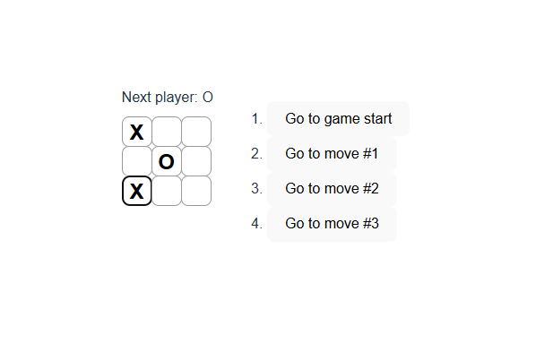

# Tic-Tac-Toe React

A simple, interactive Tic-Tac-Toe game built with React.



## Description

This project is a web-based implementation of the classic Tic-Tac-Toe game. Players take turns marking X and O on a 3x3 grid. The first player to get three of their marks in a row (horizontally, vertically, or diagonally) wins the game.

## Features

- Interactive game board
- Player turn tracking
- Win detection
- Game reset functionality

## Technologies Used

- React.js
- JavaScript
- HTML/CSS

## Installation

1. Clone the repository:
   ```
   git clone https://github.com/Juan-Ceballos/Tic-Tac-Toe-React.git
   ```

2. Navigate to the project directory:
   ```
   cd Tic-Tac-Toe-React
   ```

3. Install dependencies:
   ```
   npm install
   ```

4. Start the development server:
   ```
   npm start
   ```

5. Open your browser and navigate to `http://localhost:3000`

## How to Play

1. The game starts with Player X
2. Click on any empty square to place your mark
3. Players take turns placing their marks
4. The first player to get three in a row wins
5. If all squares are filled and no player has three in a row, the game is a draw
6. Click the reset button to start a new game

## License

This project is open source and available under the [MIT License](LICENSE).

## Author

Juan Ceballos
